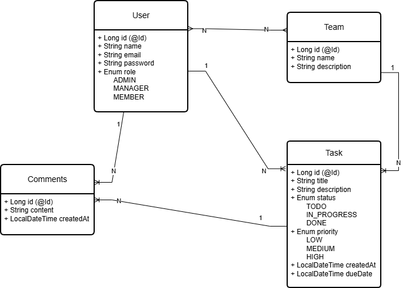

TaskMan: A Team Task & Workflow Management System

A Backend project using SpringBoot that lets teams handle task management, user assigning and workflow status tracking.
This project is built from scratch to understand core backend features and implementation techniques.

The following model is planned for now:

## Planned Role Based Access
Admin -
- Create teams
- Add/remove users from teams
- Assign roles
- Delete teams
- View everything

Manager-
- Create tasks
- Assign tasks to users
- Update any task in their team
- View team tasks
- Add comments

Member-
- View tasks assigned to them
- Update status of their own tasks
- Add comments
- Cannot assign tasks
- Cannot delete teams

## Planned Features

- ~~Task CRUD operations~~
- ~~Team management~~
- ~~Comments on tasks~~
- User registration and login
- ~~JWT Authentication~~
- Role-based authorization (ADMIN, MANAGER, MEMBER)
- ~~Filtering and pagination~~
- Docker deployment

## Business Rules
### User Rules
1. User Creation 
   - User can be created without belonging to a team. 
   - Password is hidden from API responses. 
   - Role is assigned at creation (ADMIN, MANAGER, MEMBER).
2. User Deletion
   - If user is the only ADMIN, deletion is blocked.
   - All tasks assigned to the user are unassigned before deletion.
   - Tasks are NOT deleted.
3. Assign User to Team 
   - If user already belongs to that team then no changes.
   - If user belongs to another team:
     - All assigned tasks are unassigned.
     - Then user is moved to new team.
4. Unassign User from Team
   - User must currently belong to a team.
   - All assigned tasks are unassigned.
   - Then user.team is set to null.

### Team Rules
1. Team Creation
   - Team name must be unique.
   - Name is normalized (trimmed).
   - Database-level unique constraint.
2. Team Update
   - Name is normalized.
   - If name is changed:
     - Must remain unique.
     - Description can be updated freely.
3. Team Deletion
   - If team has tasks → deletion is blocked.
   - If team has users:
     - Users are automatically unassigned.
     - Team is deleted only after cleanup.

### Task Rules
1. Task Creation
   - Task must belong to a team.
   - Task may initially be unassigned (user = null).
2. Assign Task to User
   - Both task and user must belong to a team.
   - If teams differ → assignment is rejected.
   - Reassignment to another user is allowed.
3. Unassign Task
   - Task must currently have a user assigned.
   - No team validation required.

### Comment Rules
1. Comment Creation
   - Comment must belong to a task.
   - Comment must have an author (user).
   - Both task and user must belong to same team.
   - Only content is provided by client.
2. Comment Update
   - Only comment content can be updated.
   - User and Task cannot be changed.
3. Comment Deletion
   - Deleting a comment does not affect task.
   - Deleting a comment does not affect user.
4. User Deletion Impact
   - All comments authored by the user are deleted before user deletion.

## Current Progress

- Spring Boot project initialized
- GitHub repository connected
- Entities created:
  - User
  - Task
  - Team
  - Comment
- Enums added:
  - TaskStatus
  - TaskPriority
  - UserRole
- Basic database structure prepared
- Task CRUD operations
- H2 database connected
- User CRUD operations
- Task and User relationship mapped
- Task assignment and unassignment handled
- Team CRUD operations
- User assignment and unassignment
- Custom exceptions added
- Validation for data implemented
- Comment CRUD operations
- Response DTOs integrated
- Pagination for user,tasks,comments
- BCrypt encrypted password
- User authentication using Jwt
