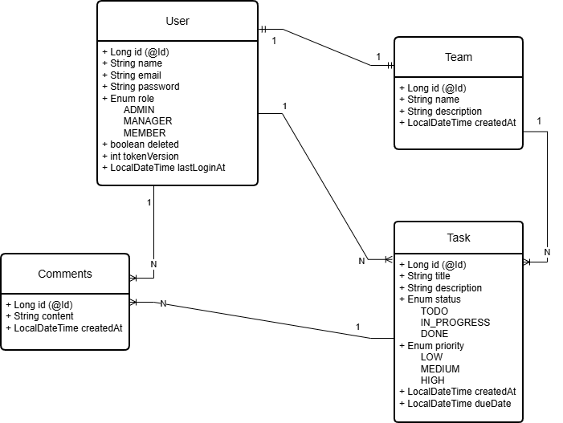

TaskMan: A Team Task & Workflow Management System

TaskMan is a backend system for managing tasks in teams, providing role-based access control and secure authentication.

This project is built with Spring Boot, focusing on practical backend architecture, security, and scalability.

## Core Features
- JWT-based Authentication
- Role-based Access Control
  1. ADMIN 
  2. MANAGER 
  3. MEMBER
- Task Management 
  1. Create 
  2. Update 
  3. Assign
- Team Management
- Comment System on Tasks
- Pagination & Filtering
- Token Versioning
- Global Logout
- Soft Deletion of Users
- Dockerized Application
- Flyway DB Migration

## Followed model:


## Architecture
``` Controller –> Service –> Repository ```

- DTO-based API (without entity exposure)
- Business rules implemented in service layer
- Security implemented through JWT with filter chain

## Tech Stack
- Java 21
- Spring Boot
- Spring Security (JWT)
- PostgreSQL
- Hibernate/JPA
- Flyway
- Docker
- JUnit, Mockito

## How to Run
``` 
git clone https://github.com/Flicko75/taskman.git
cd TaskMan
 ```
### Run locally
``` 
mvn spring-boot:run
```
### With Docker
``` 
docker-compose up
```

## API Endpoints (Core)
- ``` POST   /api/auth/login ```
- ``` POST   /api/tasks ```
- ``` GET    /api/tasks ```
- ``` PUT    /api/tasks/{id} ```
- ``` DELETE /api/tasks/{id} ```

## Business Rules (Highlights)
### Users
- Soft deletion (not removed from DB)
- Token versioning for secure logout
- Cannot delete last ADMIN
### Tasks
- Must belong to a team
- Assignment only within same team
- Reassignment allowed
### Teams
- Unique name constraint
- Cannot delete if tasks exist
### Comments
- Must belong to task + user
- Team consistency enforced

## Testing
- Unit tests for service layer (~150 tests)
- Integration tests for full request flow

## Business Rules (Detailed)
### User Rules
1. User Creation 
   - User can be created without belonging to a team. 
   - Password is hidden from API responses. 
   - Role is assigned at creation (ADMIN, MANAGER, MEMBER).
2. User Deletion
   - If user is the only ADMIN, deletion is blocked.
   - All tasks assigned to the user are unassigned before deletion.
   - Tasks are NOT deleted.
3. Assign User to Team 
   - If user already belongs to that team then no changes.
   - If user belongs to another team:
     - All assigned tasks are unassigned.
     - Then user is moved to new team.
4. Unassign User from Team
   - User must currently belong to a team.
   - All assigned tasks are unassigned.
   - Then user.team is set to null.
5. User Update
   - Email must be unique.
   - Changes to roles must be in order of hierarchy:
     - Only ADMINs can assign ADMIN roles.
   - A user cannot demote themselves.
6. User Authentication
   - Login will fail if the user has been soft deleted.
   - Token becomes invalid if:
     - Token version has changed (logout)
     - User has been deleted
7. Last Login Tracking
   - lastLoginAt will be updated with every successful login.
   - Unsuccessful login attempts will not update this field.

### Team Rules
1. Team Creation
   - Team name must be unique.
   - Name is normalized (trimmed).
   - Database-level unique constraint.
2. Team Update
   - Name is normalized.
   - If name is changed:
     - Must remain unique.
     - Description can be updated freely.
3. Team Deletion
   - If team has tasks → deletion is blocked.
   - If team has users:
     - Users are automatically unassigned.
     - Team is deleted only after cleanup.
4. Team Membership Consistency
   - A user may only be a member of one team at a time.
   - A team must exist before users are assigned to it.
5. Team Visibility
   - Non-admin users may only see:
     - Their own teams
     - Their own tasks within a team

### Task Rules
1. Task Creation
   - Task must belong to a team.
   - Task may initially be unassigned (user = null).
2. Assign Task to User
   - Both task and user must belong to a team.
   - If teams differ → assignment is rejected.
   - Reassignment to another user is allowed.
3. Unassign Task
   - Task must currently have a user assigned.
   - No team validation required.
4. Task Update
   - Task must be present before updating.
7. Task Deletion
   - Only ADMIN or MANAGER can delete tasks.
8. Task Fetching
   - Users can only view:
     - tasks assigned to them OR
     - tasks within their team (depending on role)

### Comment Rules
1. Comment Creation
   - Comment must belong to a task.
   - Comment must have an author (user).
   - Both task and user must belong to same team.
   - Only content is provided by client.
2. Comment Update
   - Only comment content can be updated.
   - User and Task cannot be changed.
3. Comment Deletion
   - Deleting a comment does not affect task.
   - Deleting a comment does not affect user.
4. User Deletion Impact
   - All comments authored by the user are deleted before user deletion.
5. Comment Authorization
   - Only the author of the comment can update it.
   - Only:
     - author
     - admin
     can delete a comment.
6. Comment Visibility
   - Users can only view comments for tasks within their team

### Security Rules
1. Token Validation
   - All requests must contain a valid JWT token, except for public endpoints.
   - Token should contain:
     - username
     - role
     - tokenVersion
2. Soft Deleted Users
   - Cannot:
     - login
     - access any API
   - Still referenced by:
     - admin for historical records

### Data Integrity Rules
1. Referential Integrity
   - Tasks must always reference a valid team.
   - Comments must always reference a valid task.
2. Cascading Behavior
   - Deleting task → deletes comments
   - Deleting user → deletes comments authored
3. Indexing
   - Indexed fields:
     - user email
     - task status
     - team name
